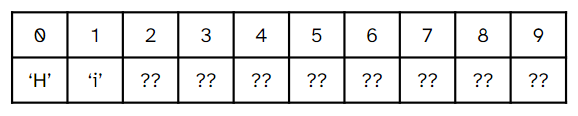

# Welcome to COMP1521!
Week 1 Tute

---

# Hello!
- Course Overview
- Introductions
- Tute Questions
- Off to the lab!

---

# Course Overview
 - Quite similar to COMP1511.
 - Course website tour.

---

# Introductions!

- Name
- Pronouns
- Year/Degree
- Highlight of your last week

---

# Question 2
Explain the difference between `s1` and `s2` in the below code fragment.

```C
#include <stdio.h>

char *s1 = "abc";

int main(void) {
    char *s2 = "def";
    // ...
}
```

Where is each variable located in memory? Where are the strings located?

---

# How Memory is Structured


---

# Question 3
What is wrong with the following code?
```C
#include <stdio.h>

int *get_num_ptr(void);

int main(void) {
    int *num = get_num_ptr();

    printf("%d\n", *num);
}

int *get_num_ptr(void) {
    int x = 42;
    return &x;
}
```

Assuming we still want `get_num_ptr` to return a pointer, how can we fix this code?

How does fixing this code effect each variable's location in memory?


---


# Question 4
Consider the following C program:

```C
#include <stdio.h>

int main(void) {
    char str[10];
    str[0] = 'H';
    str[1] = 'i';
    printf("%s", str);
    return 0;
}
```

What will happen when the above program is compiled and executed?
In particular, what does this look like **in memory?**
*(What's different with compiling it with `gcc` vs `dcc`?)*

---

# `str` in Memory



---

# Question 5

How can we fix the code from question 4?

```C
#include <stdio.h>

int main(void) {
    char str[10];
    str[0] = 'H';
    str[1] = 'i';
    printf("%s", str);
    return 0;
}
```

---

# Command-Line Arguments
Consider this command:
```shell
$ dcc -o program program.c
```
We're executing the `dcc` program, and giving it some information.
How can we use information from the command line in our code?

---

# Question 6

Consider this program:
```C
#include <stdio.h>

int main(int argc, char *argv[]) {
    printf("argc=%d\n", argc);
    for (int i = 0; i < argc; i++) {
        printf("argv[%d]=%s\n", i, argv[i]);
    }
    return 0;
}
```

What are `argc` and `argv`? What will be the output of the following commands?

```shell
$ dcc -o program q6.c
$ ./program I love MIPS
```

---

# Question 7
The following prgram sums up command-line arguments.
```C
#include <stdio.h>
#include <stdlib.h>

int main(int argc, char *argv[]) {
    int sum = 0;
    for (int i = 0; i < argc; i++) {
        sum += atoi(argv[i]);
    }
    printf("sum of command-line arguments = %d\n", sum);
    return 0;
}
```

Why do we need `atoi` in this code?
What happens if the command-line arguments are not integers?

---

# Recursion!

---

# Recursion Example: Factorial

We want to write a function that can calculate the factorial of some positive integer `n`.

Let's analyse the problem!

---


# What is a Factorial?

$n! = 1\times2\times3\times...\times (n-1)  \times n.$

For example:
$3! = 3\times2\times1 = 6.$
$5! = 5\times4\times3\times2\times1 = 120.$

---

# Recursion Example: Factorial

Solving the problem without recursion:
```C
int fact(int n) {
    int total = 1;
    int i = 1;

    while (i < n) {
        total *= i;
        i++;
    }

    return total;
}
```

---

# Recursion Example: Factorial
A function that calls itself.


---


# More Thinking 🤓
$5! = 5\times(4\times3\times2\times1).$
$5! = 5\times4!.$

Going further:
$n! = n\times(n-1)!.$

---

# Recursion Example: Factorial

Solving the problem with recursion:
```C
int fact(int n) {
    if (n == 1) {
        return 1;
    }

    return n * fact(n - 1);
}
```

---

# Hints and Tips
 - Remember to read the "Hint" sections in the lab excercises.
 - Using the C manual in the command-line.

---

Do we have some more time to have a look at some MIPS?

---

# What is MIPS?
- When a high-level language like C gets compiled, the compiler has to do a lot of work to convert it into machine code.
- Mips is an assembly language, which, unlike machine code, is still human-readable, but it's very easy to convert mips into machine code.
- We use a type of mips called mipsy, which has some handy pseudo-instructions.

---

# Looking at Some MIPS Code

```mips
.text
main:

	li	$v0, 4			# syscall 4: print_string
	la	$a0, hello_world_msg	
	syscall				# printf("Hello world\n");


	li	$v0, 0
	jr	$ra			# return 0;

	.data

hello_world_msg:
	.asciiz	"Hello world\n"
```